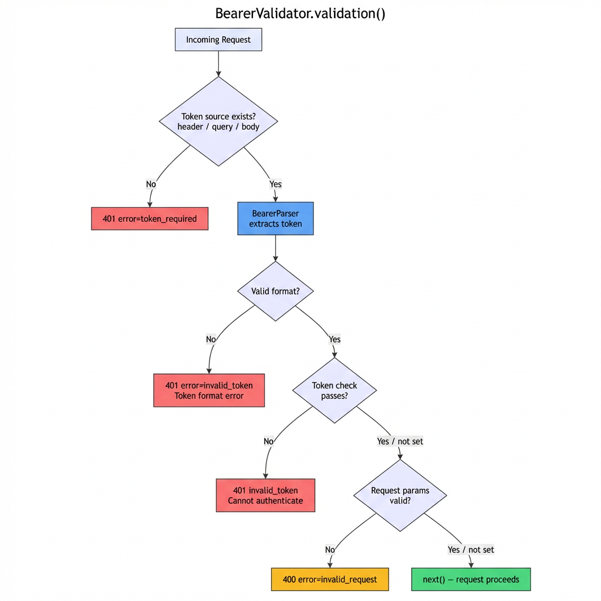

# bearer-token-parser

[](https://www.npmjs.com/package/bearer-token-parser)
[](LICENSE)

Zero-dependency Bearer token parser & validator middleware for Express.
Extracts and validates tokens from headers, query strings, and request bodies with full async support.

### Features

- **3 token sources** — Authorization header, query string, request body
- **Async-ready** — `tokenCheckCallback` and `requestParameterCheck` support both sync and async functions
- **RFC 6750 compliant** — automatic `WWW-Authenticate` error responses
- **Zero dependencies** — only Express as a peer dependency
- **TypeScript included** — ships with type definitions out of the box
- **ESM & CJS** — works with `import` and `require`
- **Express 4 & 5** — compatible with both major versions

## Installation

```bash
npm i bearer-token-parser
```

```js
// ESM
import {BearerParser, BearerValidator} from 'bearer-token-parser';

// CommonJS
const {BearerParser, BearerValidator} = require('bearer-token-parser');
```

## Quick Start

Protect any Express route with Bearer token authentication in just a few lines.
Pass `BearerValidator.validation()` as route middleware — it extracts the token, runs your check, and rejects invalid requests with proper `WWW-Authenticate` headers automatically.

```js
import express from 'express';
import {BearerParser, BearerValidator} from 'bearer-token-parser';

const app = express();

app.get('/api/protected', [
  BearerValidator.validation({
    realm: 'my-api',
    tokenCheckCallback: async (token) => {
      // Verify token against your database, JWT, etc.
      // Return true if valid, false otherwise.
      const user = await db.findUserByToken(token);
      return user != null;
    },
  })
], (req, res) => {
  // Token is valid — extract it if needed.
  const token = BearerParser.parseBearerToken(req);
  res.json({authenticated: true, token});
});
```

## How It Works

This library provides two classes:

**BearerValidator** creates Express middleware that validates Bearer tokens and automatically responds with RFC 6750-compliant `WWW-Authenticate` headers on failure.

**BearerParser** extracts Bearer tokens from requests. Used internally by BearerValidator, but also available for standalone use — it only needs a plain request object with `headers`, `query`, or `body`.

### Validation Flow



<!-- Mermaid source: screenshots/validation-flow.mmd -->

When all checks pass, the middleware calls `next()` and your route handler receives the request as normal.

### Error Responses

On failure, the middleware responds via `BearerValidator.resWithWwwAuthenticate()` with a `WWW-Authenticate` header following [RFC 6750](https://datatracker.ietf.org/doc/html/rfc6750):

| HTTP Status | WWW-Authenticate | When |
|-------------|-----------------|------|
| 401 | `Bearer realm="…", error="token_required"` | Token source is missing (no header / no query param / no body param) |
| 401 | `Bearer realm="…", error="invalid_token", error_description="Token format error"` | Token is empty or has an invalid format |
| 401 | `Bearer realm="…", error="invalid_token", error_description="Token cannot be authenticated"` | `tokenCheckCallback` returned `false` |
| 400 | `Bearer realm="…", error="invalid_request"` | `requestParameterCheck` returned `false` |

## Usage Examples

### Token from Authorization Header (default)

```js
import express from 'express';
import {BearerValidator} from 'bearer-token-parser';

const app = express();

app.get('/api/resource', [
  // Validate the Bearer token from the Authorization header.
  BearerValidator.validation({
    realm: 'my-api',
    // Check if the token matches the expected value.
    tokenCheckCallback: token => token === process.env.API_TOKEN,
  })
], (req, res) => {
  // Only reached when the token is valid.
  res.json({ok: true});
});
```

```bash
curl -H "Authorization: Bearer <token>" http://localhost:3000/api/resource
```

### Token from Query Parameter

```js
import express from 'express';
import {BearerValidator} from 'bearer-token-parser';

const app = express();

app.get('/api/resource', [
  // Validate the token from the query string (?api_key=...).
  BearerValidator.validation({
    tokenLocation: 'query',
    tokenParameter: 'api_key',
    realm: 'my-api',
    tokenCheckCallback: token => token === process.env.API_TOKEN,
  })
], (req, res) => {
  res.json({ok: true});
});
```

```bash
curl http://localhost:3000/api/resource?api_key=<token>
```

### Token from Request Body

```js
import express from 'express';
import {BearerValidator} from 'bearer-token-parser';

const app = express();

app.post('/api/resource', [
  // Validate the token from the JSON body ({ "access_token": "..." }).
  BearerValidator.validation({
    tokenLocation: 'body',
    tokenParameter: 'access_token',
    realm: 'my-api',
    tokenCheckCallback: token => token === process.env.API_TOKEN,
  })
], (req, res) => {
  res.json({ok: true});
});
```

```bash
curl -X POST -H "Content-Type: application/json" \
  -d '{"access_token":"<token>"}' \
  http://localhost:3000/api/resource
```

### With Request Parameter Validation

You can add a second validation layer using `requestParameterCheck` to validate request body fields after the token is verified:

```js
import express from 'express';
import {BearerValidator} from 'bearer-token-parser';
import {body, validationResult} from 'express-validator';

const app = express();

app.post('/api/users', [
  body('email').isEmail(),
  body('name').isLength({min: 1, max: 50}),

  BearerValidator.validation({
    realm: 'my-api',
    // Verify the token (async supported).
    tokenCheckCallback: async (token) => {
      const user = await db.findUserByToken(token);
      return user != null;
    },
    // Validate request params after token passes.
    // Return false to respond with 400 invalid_request.
    requestParameterCheck: (req) => {
      return validationResult(req).isEmpty();
    },
  })
], async (req, res) => {
  res.json({created: true});
});
```

### Standalone Token Parsing (without validation)

`BearerParser` can be used on its own — it only needs a request object with `headers`, `query`, or `body`:

```js
import {BearerParser} from 'bearer-token-parser';

// Extract from the Authorization header ("Bearer <token>").
const headerToken = BearerParser.parseBearerTokenHeader(req);

// Extract from a query parameter (?access_token=...).
const queryToken = BearerParser.parseBearerTokenQuery(req, 'access_token');

// Extract from the request body ({ "access_token": "..." }).
const bodyToken = BearerParser.parseBearerTokenBody(req, 'access_token');

// Each returns the token string, or undefined if not found / invalid format.
```

## API Reference

### BearerParser

Utility class for extracting Bearer tokens from HTTP requests.

#### `BearerParser.parseBearerToken(req)`

Alias for `parseBearerTokenHeader`.

#### `BearerParser.parseBearerTokenHeader(req)`

Extracts a Bearer token from the `Authorization` request header. Parses the header value matching the pattern `Bearer <token>` and returns the token portion.

| Parameter | Type | Description |
|-----------|------|-------------|
| `req` | `Request \| {headers: {authorization?: string}}` | The request object |

**Returns:** `string | undefined` — The extracted token, or `undefined` if the header is missing or the format is invalid.

#### `BearerParser.parseBearerTokenQuery(req, tokenParameter?)`

Extracts a Bearer token from a query string parameter.

| Parameter | Type | Default | Description |
|-----------|------|---------|-------------|
| `req` | `Request \| {query: {[key: string]: any}}` | | The request object |
| `tokenParameter` | `string` | `'access_token'` | The query parameter name |

**Returns:** `string | undefined`

#### `BearerParser.parseBearerTokenBody(req, tokenParameter?)`

Extracts a Bearer token from the request body.

| Parameter | Type | Default | Description |
|-----------|------|---------|-------------|
| `req` | `Request \| {body: {[key: string]: any}}` | | The request object |
| `tokenParameter` | `string` | `'access_token'` | The body parameter name |

**Returns:** `string | undefined`

### BearerValidator

Express middleware for Bearer token authentication.

#### `BearerValidator.validation(options)`

Creates an Express middleware that validates Bearer tokens. Extracts a token from the configured location, validates it, and either calls `next()` on success or responds with a `401`/`400` status and `WWW-Authenticate` header on failure.

| Option | Type | Default | Description |
|--------|------|---------|-------------|
| `tokenLocation` | `'header' \| 'query' \| 'body'` | `'header'` | Where to extract the token from |
| `tokenParameter` | `string` | `'access_token'` | Parameter name for query/body tokens. Required when `tokenLocation` is `'query'` or `'body'`. |
| `realm` | `string` | `''` | Realm name included in the `WWW-Authenticate` response header |
| `tokenCheckCallback` | `(token: string) => boolean \| Promise<boolean>` | — | Validates the extracted token. Supports sync and async functions. |
| `requestParameterCheck` | `(req: Request) => boolean \| Promise<boolean>` | — | Validates request parameters after token verification. Supports sync and async functions. |

**Returns:** Express middleware function `(req, res, next) => Promise<void>`

**Throws:** `TypeError` if `tokenLocation` is `'query'` or `'body'` and `tokenParameter` is empty.

#### `BearerValidator.resWithWwwAuthenticate(res, statusCode, realm, error?, errorDescription?)`

Sends an HTTP response with a `WWW-Authenticate` header following RFC 6750. Can be used directly for custom error responses.

| Parameter | Type | Description |
|-----------|------|-------------|
| `res` | `Response` | The Express response object |
| `statusCode` | `number` | HTTP status code (e.g., `401`, `400`) |
| `realm` | `string` | Realm name for the `WWW-Authenticate` header |
| `error` | `string?` | Error code (e.g., `'invalid_token'`) |
| `errorDescription` | `string?` | Human-readable error description |

```js
// Custom error response example
BearerValidator.resWithWwwAuthenticate(res, 401, 'my-api', 'invalid_token', 'The token has expired');
// => WWW-Authenticate: Bearer realm="my-api", error="invalid_token", error_description="The token has expired"
```

### BearerValidatorOptions

TypeScript interface for the `validation()` options. Available as a named export for type-safe configuration:

```typescript
import {BearerValidator, BearerValidatorOptions} from 'bearer-token-parser';

const options: BearerValidatorOptions = {
  tokenLocation: 'header',
  realm: 'my-api',
  tokenCheckCallback: async (token) => {
    // Your validation logic.
    return token === process.env.API_TOKEN;
  },
};

app.use('/api', BearerValidator.validation(options));
```

## Changelog

See [CHANGELOG.md](CHANGELOG.md).

## Author

**shumatsumonobu**

- [github/shumatsumonobu](https://github.com/shumatsumonobu)
- [X/shumatsumonobu](https://x.com/shumatsumonobu)

## License

[MIT](LICENSE)
